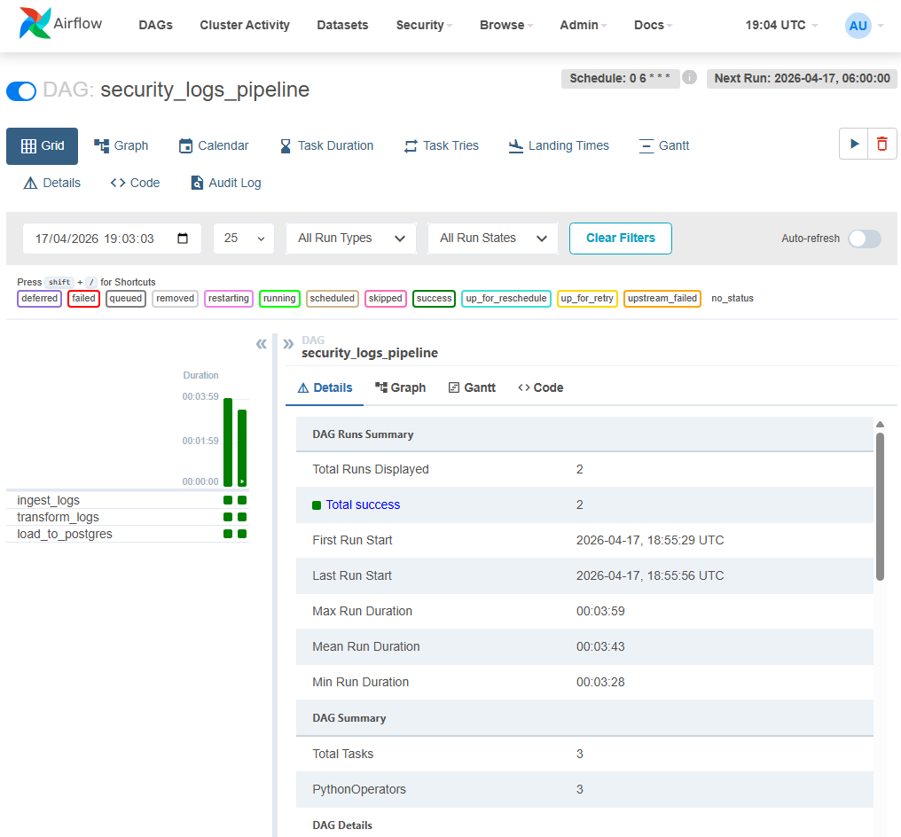

# Pipeline ETL de Logs de Segurança

Projeto desenvolvido para a vaga de **Junior Data Engineer**, focando em processamento de dados para o contexto de Cibersegurança (Gestão de Acesso Privilegiado - PAM).



## O Projeto
Este pipeline simula a ingestão, transformação e armazenamento de logs de acesso a servidores críticos. O foco principal foi criar uma arquitetura que suporte **auditoria e compliance** — conceitos vitais em produtos PAM.

### ⚙️ Arquitetura
1. **Ingestão:** Script Python simulando acessos de usuários reais e bots, gerando cenários com sucesso e falhas (15% de falha).
2. **Transformação:** Pandas processa o CSV, formata timestamps, e roda uma **regra de detecção de anomalias** (>5 falhas em 10 minutos de um mesmo usuário).
3. **Modelagem:** Os dados são divididos em um **Star Schema**, ideal para Business Intelligence.
4. **Armazenamento:** Carga no PostgreSQL (`fact_access`, `dim_user`, `dim_system`, `dim_time`).
5. **Orquestração:** Apache Airflow executa a DAG diariamente.

## Tecnologias Utilizadas
- **Linguagem:** Python 3.13 + Pandas
- **Banco de Dados:** PostgreSQL (via SQLAlchemy)
- **Orquestração:** Apache Airflow
- **Infraestrutura:** Docker & Docker Compose
- **Testes Automatizados:** Pytest (Validando geração do Star Schema e regras de anomalia)

## Como Executar

Clone o repositório e suba os containers:
```bash
git clone https://github.com/seu-usuario/pipeline-seguranca.git
cd pipeline-seguranca
docker compose up -d
```

Acesse o painel do Airflow em `http://localhost:8080` para monitorar as execuções.

Para rodar os testes localmente:
```bash
python -m pytest tests/ -v
```